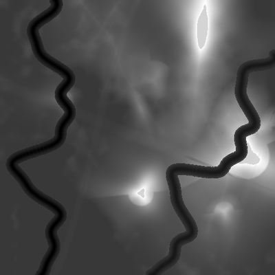
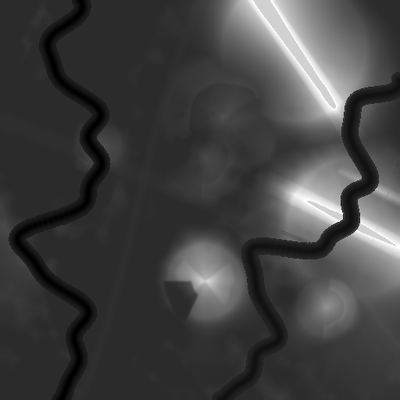
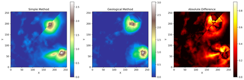
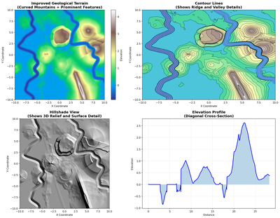
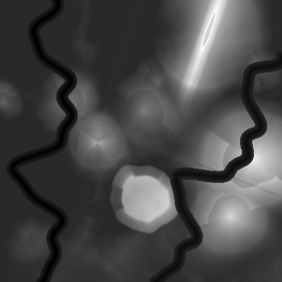
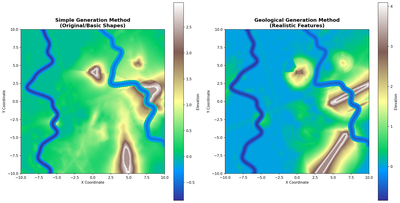

# 🏔️ Heightmap Generator

<div align="center">


*A sophisticated terrain heightmap generator with multiple generation methods and a user-friendly interface*

</div>

---

## 🎨 Visual Showcase

### Terrain Generation Examples

| Simple Method | Geological Method |
|:-------------:|:-----------------:|
|  |  |
| Basic mountain generation with clean, smooth peaks | Advanced geological-inspired terrain with realistic features |

### Method Comparison

*Side-by-side comparison of different generation techniques*

### Advanced Geological Terrain

*High-detail geological terrain with complex mountain formations*

### Generated Heightmap

*Grayscale heightmap showing elevation data*

## 📁 Project Structure

```
hightMapGen/
├── src/                    # Core source code
│   ├── main_cv2.py        # Main terrain generation engine
│   └── ui_generator.py    # UI-integrated generator
├── ui/                    # User interface files
│   ├── ui.py             # Main tkinter UI
│   └── view_terrain.py   # Terrain viewer
├── config/               # Configuration files
│   └── config.py        # Settings and parameters
├── tests/                # Test files
│   ├── test_*.py        # Various test scripts
├── launchers/            # Quick launcher scripts
│   ├── quick_ui_launcher.py
│   ├── command_line_generator.py
│   └── run_tests.py
├── output/               # Generated content
│   ├── maps/            # Generated heightmaps (.tif)
│   └── images/          # Preview images (.png)
├── docs/                 # Documentation
│   └── README_*.md      # Various documentation files
└── run_ui.py            # Main application launcher
```

## 🚀 Quick Start

<div align="center">

### 🎮 Easy Launch Options

</div>

| Method | Command | Description |
|--------|---------|-------------|
| 🖱️ **Double-Click** | `START_UI.bat` | **Recommended** - Just double-click for instant start |
| 🐍 **Python** | `python run_ui.py` | Run directly with Python |
| ✨ **Enhanced** | `python launchers/quick_ui_launcher.py` | Launcher with better error messages |
| ⌨️ **Command Line** | `python launchers/command_line_generator.py` | Generate terrain without UI |

### 📦 **Installation**
```bash
# Install dependencies
pip install numpy opencv-python Pillow tkinter

# Run the application
python run_ui.py
```

## 🛠️ Features

### 🏔️ Advanced Terrain Generation
- **Multiple Algorithms**: Choose between Simple and Geological generation methods
- **Six Mountain Types**: Varied, Peaked, Ridge, Mesa, Volcano, and Asymmetric
- **Custom Parameters**: Fully configurable terrain properties
- **High Resolution Support**: Generate large, detailed heightmaps
- **Geological Realism**: Physics-inspired terrain features

### 🖥️ User-Friendly Interface
- **Modern UI**: Clean tkinter interface with tabbed organization
- **Real-time Preview**: Instant visual feedback with color and grayscale modes
- **Interactive Controls**: Sliders, dropdowns, and input fields for all parameters
- **Progress Tracking**: Live progress updates during generation
- **Error Handling**: Graceful error reporting and recovery

### 🏗️ Mountain Management System
- **Custom Mountains**: Add, edit, and remove individual mountains
- **Position Control**: Precise X/Y coordinate placement
- **Height Variation**: Configurable mountain heights and widths
- **Type Selection**: Apply different mountain types to individual peaks
- **Batch Operations**: Manage multiple mountains efficiently

### 💾 Export & Output Options
- **Multiple Formats**: Export as TIFF (16-bit) or PNG
- **High Quality**: Preserves full elevation data precision
- **Organized Output**: Automatic file organization in `output/` folder
- **Naming Convention**: Timestamp-based file naming
- **Preview Generation**: Automatic color preview images

## 📦 Dependencies

```bash
pip install numpy opencv-python Pillow tkinter
```

## 🧪 Testing

Run all tests:
```bash
python launchers/run_tests.py
```

Run specific test:
```bash
python tests/test_mountain_types.py
```

## ⚙️ Configuration

Edit `config/config.py` to customize:
- Terrain parameters
- Mountain types
- Export settings
- UI preferences

## 🎯 Mountain Types

The generator supports six distinct mountain generation algorithms, each creating unique terrain characteristics:

| Type | Description | Best For |
|------|-------------|----------|
| 🏔️ **Varied** | Mixed terrain with diverse features and natural randomness | General purpose, realistic landscapes |
| ⛰️ **Peaked** | Sharp, pointed mountain peaks with steep slopes | Dramatic alpine scenes, rocky terrains |
| 🗻 **Ridge** | Long mountain ridges and deep valleys | Mountain ranges, hiking trail maps |
| 🏜️ **Mesa** | Flat-topped mountains with steep sides | Desert landscapes, plateau regions |
| 🌋 **Volcano** | Cone-shaped volcanic mountains with crater-like peaks | Volcanic islands, geothermal areas |
| 🏞️ **Asymmetric** | Irregular, non-symmetrical peaks with complex geometry | Weathered mountains, eroded terrains |

*Each mountain type uses different mathematical algorithms to create authentic geological features.*

## 📝 Usage Examples

### Basic Terrain Generation
1. Launch the UI: `python run_ui.py`
2. Go to the "Terrain" tab
3. Select mountain type and parameters
4. Click "Generate Heightmap"
5. Preview and export your terrain

### Custom Mountain Configuration
1. Edit mountains in the "Mountains" tab
2. Set custom positions and properties
3. Use "Custom" mountain type in terrain generation

## 🖼️ Gallery

### Generation Method Comparison


*Comprehensive comparison showing the difference between Simple and Geological generation methods*

> **💡 Tip**: All images are automatically saved to the `output/images/` folder when you generate terrain. The `output/maps/` folder contains the high-quality TIFF heightmap files.

## 🤝 Contributing

1. Place new features in appropriate folders (`src/`, `ui/`, etc.)
2. Add tests in the `tests/` folder
3. Update configuration in `config/config.py`
4. Create launchers for new tools in `launchers/`

## 📄 License

This project is open source. See individual files for specific license information.
